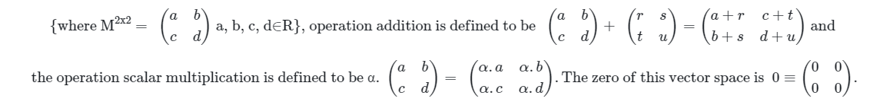

This experiment has been designed to help students with the understanding of the 2-dimensional Euclidean space which is commonly visualized as the flat plane and is mathematically represented as the real vector space <i>R</i>2, essentially the set of all ordered pairs of real numbers, by exploring the relationship between points on the plane and elements in <i>R</i>2. Vector representation of a point in plane is also given. Thus students will gain a deeper appreciation of how geometry and linear algebra are interconnected. Besides, the experiment encourages learners to extend this understanding to more abstract, higher-dimensional spaces, thereby building a foundation for studying vector spaces, in general. Here, <i>N</i> and <i>R</i> denote the natural numbers and real number respectively.Let <i>N</i> and <i>R</i> denote the natural numbers and real numbers respectively.

**1. 2-dimensional Euclidean Space:**
 The system ( <i>R</i>2 ,+ , . ) together with <i>R</i> is the 2-dimensional Euclidean space, where

**(i)**  <i>R</i>2 = { (<i>x</i> , <i>y</i>) | (<i>x</i> , <i>y</i>)∈ <i>R</i> }  
**(ii)** + , called addition, is defined as  
&emsp; (<i>a</i> , <i>b</i>) + (<i>c</i> , <i>d</i>) = ( <i>a+c</i> , <i>b+d</i> ); where (<i>a</i> , <i>b</i>) and (<i>c</i> , <i>d</i>) ∈ <i>R</i>2  
**(iii)** . , called scalar multiplication, is defined as   
&emsp; <i>α</i> . (<i>a</i> , <i>b</i>) = (<i>α . a</i> , <i>α . b</i>); where α ∈ <i>R</i> and (<i>a</i> , <i>b</i>) ∈ <i>R</i>2 .  

Note that,

**a.** In (ii), "+" on the left side is the addition of <i>R</i>2 and on the right side it is the addition of <i>R</i>. For example, when (2, 3) and (1, 4) in <i>R</i>2 are added, we have (2, 3) + (1, 4) = (2+1, 3+4). Here ‘‘+’’ on the left side is the addition of <i>R</i>2 and on the right side it is the addition of <i>R</i>. 
**b.** In (iii), "." on the left side is the scalar multiplication of <i>R</i>2 and on the right side it is the multiplication of <i>R</i>. For example, when 2 in <i>R</i> and (2, 3) in <i>R</i>2 are multiplied, we have 2.(2, 3)=(2.2, 2.3). Here ‘‘.’’ on the left side is the scalar multiplication of <i>R</i>2 and on the right side it is the multiplication of <i>R</i>. 

**2. Geometric Visualization:**
It is well known that there is a one-to-one correspondence between the plane and <i>R</i>2. That is, for each point on the plane there corresponds an element of <i>R</i>2 and conversely, to each element of <i>R</i>2 there is a point in the plane. **It may be noted** that this association between points in the plane and the elements in <i>R</i>2 is with respect to a given pair of axes. Thus given a point on the plane, if we change the chosen axes, the element in <i>R</i>2 may be changed. Similarly, given an element in <i>R</i>2, if we change the chosen axes, a different point on the plane may be obtained. 
In the same manner, <i>R</i> and <i>R</i>3 can be identified with the line and space respectively. Such a visualization is not possible for <i>R</i><Rn , for n>3.

**3. Math Model of Line, Plane and Space:**
The one-to-one correspondence between the plane and <i>R</i>2, described above provides an identification of plane with <i>R</i>2. Therefore <i>R</i>2 serves as a mathematical model for the study of the plane. Similarly, R and <i>R</i>R3 serve as mathematical models for the study of the line and the space, respectively.

**4. Vector Representation:**
Let P be a point in the given Fig.1. Let (<i>u</i>, <i>v</i>) be the corresponding ordered pair. The line segment joining the origin and the point directed towards the point is called the vector at the origin associated with the point P. Please see the diagram given below.

 

**5. n-dimensional Euclidean Space:**
 It is the system ( <i>R</i>n , + , . ) together with <i>R</i>, where <i>R</i>n = {(<i>x</i>1, <i>x</i>2, <i>x</i>3, ... , <i>x</i>n) | <i>x</i>1, <i>x</i>2, <i>x</i>3, ... , <i>x</i>n ∈ <i>R</i>} and operations + and . called addition and scalar multiplication respectively are defined as:

**(i)** {(<i>x</i>1, <i>x</i>2, <i>x</i>3, ... , <i>x</i>n) + (<i>y</i>1, <i>y</i>2, <i>y</i>3, ... , <i>y</i>n) = (<i>x</i>1+<i>y</i>1 , <i>x</i>2+<i>y</i>2 , ... , <i>x</i>n+<i>y</i>n)}; where (<i>x</i>1, <i>x</i>2, <i>x</i>3, ... , <i>x</i>n) , (<i>y</i>1, <i>y</i>2, <i>y</i>3, ... , <i>y</i>n) ∈ <i>R</i>n  
**(ii)** α . (<i>x</i>1, <i>x</i>2, <i>x</i>3, ... , <i>x</i>n) = (<i>α.x</i>1, <i>α.x</i>2, <i>α.x</i>3, ... , <i>α.x</i>n); where <i>α</i> ∈ <i>R</i> and (<i>x</i>1, <i>x</i>2, <i>x</i>3, ... , <i>x</i>n) ∈ <i>R</i>n

It can be geometrically visualised for 1≤<i>n</i>≤3 only. 

**6. Vector Space:**
 Let <i>F=R</i> or <i>C</i>, where <i>C</i> is set of complex numbers which is described below in Note (ii). Given a non-empty set <i>V</i> and operations "+" **(called addition)** and "." **(called scalar multiplication)**, the system (<i>V</i> , + , .) together with <i>F</i> is called a **vector space** over <i>F</i>, if the following conditions hold:

**For Addition:**  
&emsp; **i.** For each pair of elements <i>x, y</i> ∈ <i>V</i>, there is a unique element <i>x</i> + <i>y</i> ∈ <i>V</i>   
&emsp; **ii.** Commutativity: x + y = y + x; for x, y ∈ V  
&emsp; **iii.** Associativity: (x + y) + z = x + (y + z), for x, y, z ∈ V  
&emsp; **iv.** Additive identity: There exists an element O ∈ V such that x + O = x, for x ∈ V. 
&emsp;  &emsp; This O which is the additive identity of (V, +), is called the zero of V and is denoted by 0. 
&emsp; **v.** Additive inverse: For every x ∈ V, there exists an element y ∈ V such that x + y = 0. This y is called the additive inverse of x and is denoted by -x.

**For Scalar Multiplication:**  
&emsp; **i.** For each x ∈ V and a ∈ F, there is a unique element a.x ∈ V  
&emsp; **ii.** Associativity: (ab).x = a.(bx) = x.(ab); for x ∈ V and a, b ∈ F.  
&emsp; **iii.** 1.x = x.1 = x, for x ∈ V, where 1 is the additive identity of F.

**Compatibility Conditions:**  
&emsp; **i.** Distributive Property 1: a.(x+y) = a.x + a.y; for x, y ∈ V and a ∈ F.   
&emsp; **ii.** Distributive Property 2: (a+b).x = a.x + b.x; for x ∈ V and a, b ∈ F. 

**NOTE:** (i) The elements of F are called **scalars** and the elements of V are **vectors**. A vector space over F will be denoted by V.  
(ii) Let C be the set of complex numbers and each of its elements is denoted by a+ib, where a, b∈R.  The operations ‘‘+’’ (addition), ‘‘.’’ (scalar multiplication) and ‘‘.’’ (multiplication) on C, defined as follows:   
a. Addition: (a+ib)+(c+id)=((a+c)+(b+d)i), where (a+ib) and (c+id)∈C.   
b. Scalar multiplication: α.(a+ib)=(α.a+α.ib), where α∈R and (a+ib)∈C.   
c. Multiplication: (a+ib).(c+id)=(ac-bd+(bc+ad)i), where (a+ib) and (c+id)∈C.

**7. Example**  
&emsp; **i.** The system (Rn, +, .) is a vector space over R, where addition and scalar multiplication are described above. The zero of this vector space is 0≡(0, 0, 0, …, 0). Thus elements of Rn are vectors and elements of R are scalars. In the particular case when n=1, elements of R are both vectors and scalars.  
&emsp; **ii.** The system (M2x2, +, .) is a vector space over R,where \( M = \begin{pmatrix} a & b \\ c & d \end{pmatrix} \)  
 
 
**iii.** The system (R2, +, .) is not a vector space over R, where operations addition and scalar multiplication are described as follows: (x, y)+(a, b)=(x+a, 0), where x, y, a, b&isin;R and c(x, y)=(cx, 0); where c, x, y&isin;R. Reason:  There does not exist (a, b) such that (2,1)+(a, b)=(2,1) because if exists, then (2+a, 0)=(2, 1) i.e. 0=1, a contradiction.  
 
**8. Properties**
Let V be a vector space over R. For v, w ∈ V and α ∈ F,

&emsp; **A.** 0.v = 0  
&emsp;&emsp;   (0 on the left side is the zero of F and on the right side it is the zero of V)  
&emsp; **B.** α.v = 0 implies α = 0 or v = 0 
&emsp;&emsp;   (-1).x = -x, x ∈ V, -1 ∈ F  
&emsp; **C.** α.v = α.w and α ≠ 0 implies v = w. 
&emsp; **D.** Notice that v.w and v.α are not defined.

**9. Significance**
The study of n-dimensional Euclidean space has enlightened research in many broad areas of science over the period of time. n-dimensional spaces have since become one of the foundations for formally expressing modern mathematics and physics.
